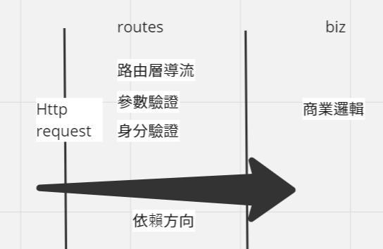

# AsiaYo APIs




### Tech Stack
   1. 前端:
   2. 後端:Python(flask)
   3. DB:
   4. 測試框架: pytest

## 專案架構
```bash
.
├── api                 # 工廠模式 建立flask instance
│   ├── biz             # 處理商業邏輯 如匯率如何轉換
│   ├── common          # 常用小工具 如資料型態轉換
│   ├── containers      # 將商業邏輯依賴注入至routes
│   ├── open-api-spec   # swagger 文件
│   ├── routes          # 路由層 處理所有http request
├── config              # 專案設定參數
├── logs                # log
├── mainapp.py          # Flask entry point
├── tests               # test      
├── README.md
├── requirements.txt
├── setup.cfg
├── setup.py
├── start-dev.py
```

## 系統需求
### Ubuntu
- Version: `22.04`
### Python
- Version: >= `3.10`

### 下載專案
```bash
git clone https://github.com/aq29287p/AsiaYo.git
```

### 建立 python virtual environment
在 project 目錄下執行下面的 command

```bash
cd AsiaYo
# 創建虛擬環境 venv
python3 -m venv venv
# 進入虛擬環境 venv
. venv/bin/activate
```

### 安裝 dependency
```bash
pip install -r requirements.txt
```
### 安裝測試框架 dependency
```bash
pip install -e .[dev]
```

### 設定檔 Config
複製 `config/sample_api_config.py` 到 `config/api_config.py`，接著修改 `config/api_config.py` 配置內容，目前無需修改
```bash
cp config/sample_api_config.py config/api_config.py
```

### 啟動專案
- 方法一指令
```bash
export FLASK_APP=mainapp.py
export FLASK_ENV=development
flask run
```
- 方法二vscode launch.json
```
mkdir .vscode
touch .vscode/launch.json
```
把以下參數丟入launch.json
```json
{
    "version": "0.2.0",
    "configurations": [
        {
            "name": "Python: Flask",
            "type": "python",
            "request": "launch",
            "module": "flask",
            "env": {
                "FLASK_APP": "mainapp.py",
                "FLASK_ENV": "development"
            },
            "args": [
                "run",
                "--no-debugger",
                "--no-reload"
            ],
            "jinja": true
        }
    ]
}
```
按下F5即可啟動

### 專案啟動後，可以透過下面的URL，來確認是否正常運作
`127.0.0.1:5000`
`127.0.0.1:5000/open-api-spec`

### 執行測試
```bash
pytest tests/
```
## 開發流程
### 建立新的 branch
```bash
git checkout -b feature/xxx
```
### 閱讀需求並撰寫文件
### 寫程式
### 寫測試跑過
### 寫swagger文件
### 推上github
```bash
git add .
git commit -m "xxx"
git push origin feature/xxx
```